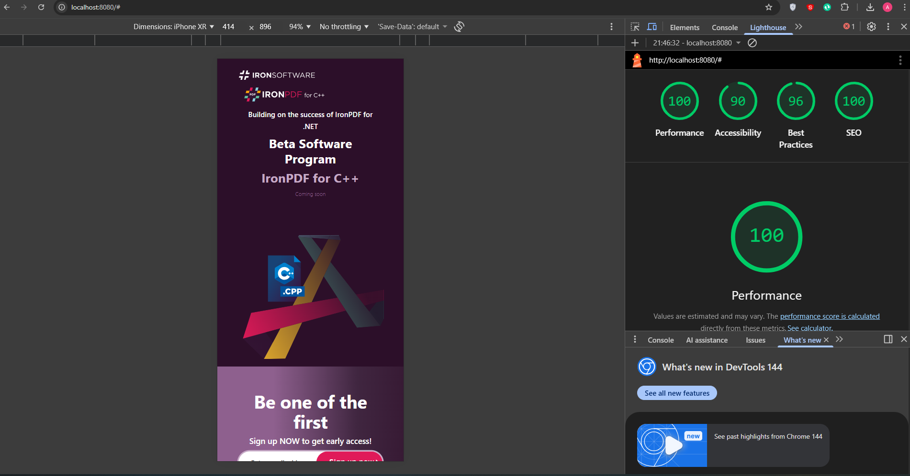

# Iron-Software Accessment
# Project Overview

This project converts the provided Figma design into a fully responsive, production-ready webpage implemented using CodeIgniter.

# Technologies used in this project

PHP with CodeIgniter 4 framework 
Composer for PHP dependency management 
HTML
Bootstrap
CSS
JavaScript pure (vanilla)
SVG/asset pipeline for images and fonts 
Apache or compatible web server
Google Lighthouse(Performance validation)

# Architecture

/app/Controllers/Home.php – Handles routing and JSON data loading

/app/Views/layouts/ – Header & footer templates

/app/Views/home.php – Main page content

/public/assets/ – CSS & JS

/public/images/ – SVG assets

/data/content.json – Page content

/data/site.json – Metadata configuration

/public/robots.txt

/public/sitemap.xml

# SEO Optimization

Head Metadata

Dynamic <title> and <meta description> from JSON

Canonical URL

Robots meta tag

Open Graph tags

Twitter Card tags

Favicon

Crawlability

robots.txt configured

sitemap.xml created at root

System directories disallowed

Content Structure

Single H1

H2/H3 hierarchy corrected

Semantic sections

Image alt optimization

# Accessibility

Semantic elements used (header, nav, section, footer)

Single H1 on page

Proper heading hierarchy

ARIA-friendly Bootstrap components

Visible focus states

Alt attributes reviewed

Decorative images handled appropriately

# QA Checklist

1. Pixel Accuracy

Compared spacing, margins, paddings with Figma inspect panel

Verified layout alignment at every's device width from large screens to mobile devices

Checked consistency of grid usage

2. Typography

Font family matches design specification

Font sizes, weights, and line heights verified

Letter spacing checked

3. Responsiveness

Tested at:
1870px

1440px

1200px

992px

768px

576px

375px

Ensured: No overflow issues, No horizontal scroll ,Proper stacking behavior ,Image scaling correct
Note: The provided Figma design is best matched for laptop/desktop.
The PDF Illustration and some large images are harder to adjust perfectly for full-screen laptop widths beyond 1440px due to scaling constraints.
Minor adjustments were made to maintain alignment without breaking layout.

4. Cross-Browser Testing

Tested on: Chrome, Brave, Safari, Firefox, Microsoft Edge

Verified: Layout consistency,Font rendering,Hover states

5. Core Web Vitals

LCP (Desktop 0.420 secs / Mobile 0.588 secs) 
CLS (Desktop 0.0 / Mobile 0.0)
FCP (Desktop 0.388 secs / Mobile 0.504 secs)
TTFB (Desktop 0.060 secs / Mobile 0.094 secs )
INP (8 ms)

6. Lighthouse Results (This project has been tested using Google Lighthouse)

Performance: 100%
Accessibility: 90%
Best Practices: 96%
SEO: 100%

Result Screen Shot

# Installation and Setup
1. Clone the Repository
git clone https://github.com/your-username/Iron-Software.git
cd Iron-Software
2. Install PHP
https://windows.php.net/download/
ensure php is ready by checking in terminal> php -v
3. Serve the app
php spark serve
4. Open in browser via
http://localhost:8080/
